<div align="center">
  

  <a href="https://github.com/KepalaLuweng">
    
  </a>
</div>
<div align="center">
  
</div>

---

### Contribution Activity Arcade

<div align="center">
  <picture>
    <source media="(prefers-color-scheme: dark)" srcset="https://raw.githubusercontent.com/KepalaLuweng/KepalaLuweng/output/github-contribution-grid-snake-dark.svg">
    <source media="(prefers-color-scheme: light)" srcset="https://raw.githubusercontent.com/KepalaLuweng/KepalaLuweng/output/github-contribution-grid-snake.svg">
    
  </picture>
</div>

---

### Core Projects

| Project | Description | Stack |
| :--- | :--- | :--- |
| **[LuwengKernel](https://github.com/KepalaLuweng/LuwengKernel)** | Custom high-performance Linux kernel for Android ARM64 platforms. Built with Proton Clang and ThinLTO, featuring microsecond thread scheduling, custom governor parameters, and native SuSFS root cloaking. | C, ARM64 Assembly, Makefile |
| **[LuwengSense](https://github.com/KepalaLuweng/LuwengSense)** | 100% native systemless hardware optimization engine and WebUI dashboard for Magisk, KernelSU, ReSukiSU, and APatch. Dynamically manages power profiles, memory swappiness, and network buffers. | POSIX Shell, JavaScript, CSS |
| **[L-Blocker](https://github.com/KepalaLuweng/L-Blocker)** | Lightweight Android DNS and host protection utility for system-level domain filtering. | Shell, Android System |

---

### Telemetry & Metrics

<div align="center">
  
  
  <br/><br/>
  
</div>

---

### Technical Expertise

```
Kernel & Hardware   : Linux Kernel 4.14+ (ARM64), Device Tree (DTS), Thermal Zones, CPUFreq Governors
Compilers & Linking : Proton Clang, LLVM, LLD Linker, ThinLTO, AnyKernel3
Root & Security     : KernelSU, ReSukiSU, APatch, SuSFS v1.5.5 / v2.x, Magisk
Systems Programming : C, ARM64 Assembly, POSIX Shell, Python, JavaScript
Networking & Memory : BBR, Cubic, FQ-Codel, ZRAM (lz4 / zstd), VFS Caching
```

---

### Connect

- **Telegram:** [t.me/luwengtechofficial](https://t.me/luwengtechofficial)
- **YouTube:** [youtube.com/@LuwengTechID](https://youtube.com/@LuwengTechID)
- **GitHub:** [github.com/KepalaLuweng](https://github.com/KepalaLuweng)
